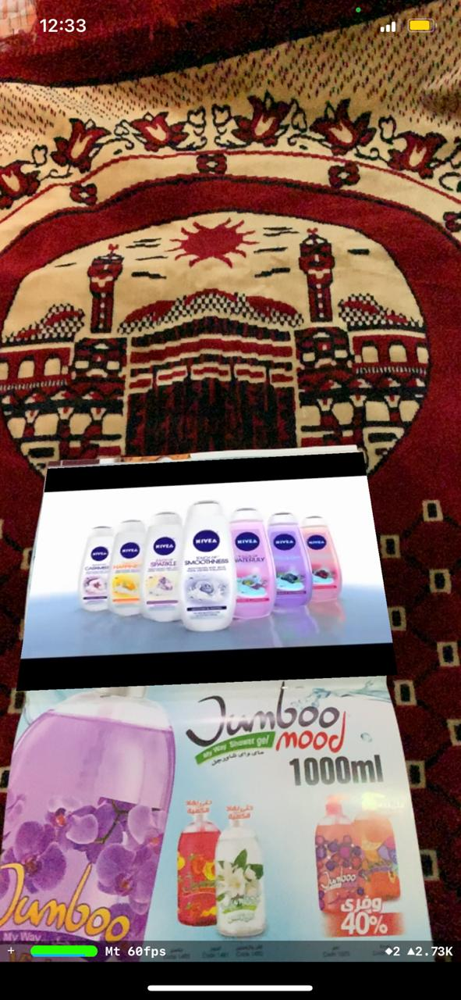

# AR-Poke3D App

## An app that use augmented reality via camera to create video you can watch when it detects a pic of the newspaper like interactive newspaper.

* Used Augmented Reality.
* Used SceneKit to implement plane so can the user position the video.
* Downloaded a video so i can play when it detects the pic of the newspaper.
* Took a pic from the newspaper and sized the plane to the pic, so when the camera detect the pic the video will be played.
* You can take a different pic but u have to name it as i named to avoid any errors and place in (Assets.xcassets) Dir as i did.

## Here is a screenshot.

